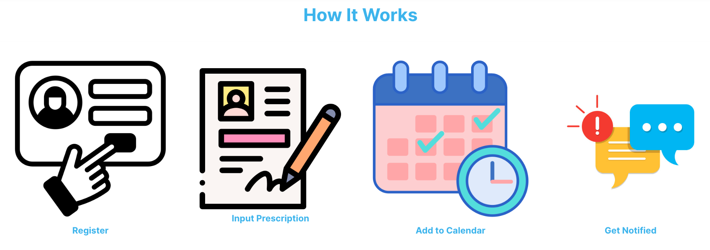
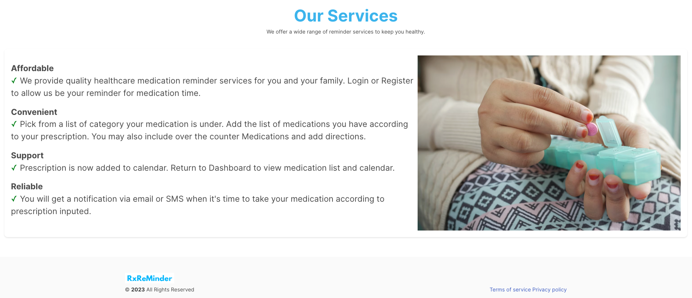
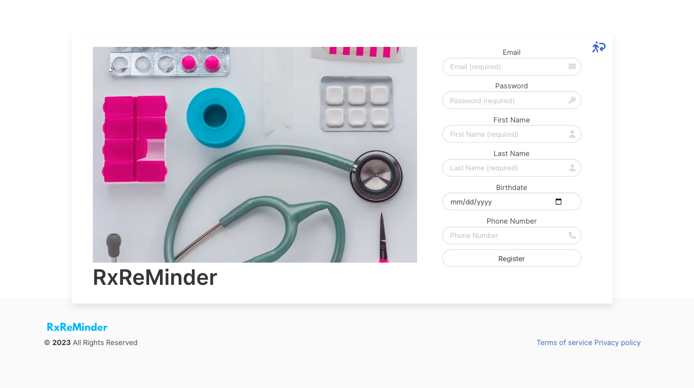
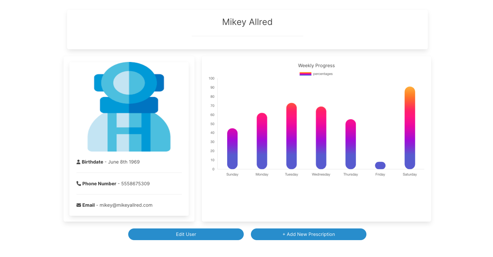
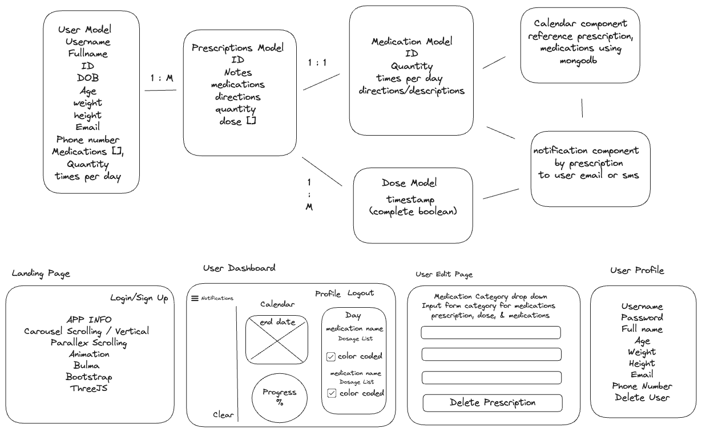
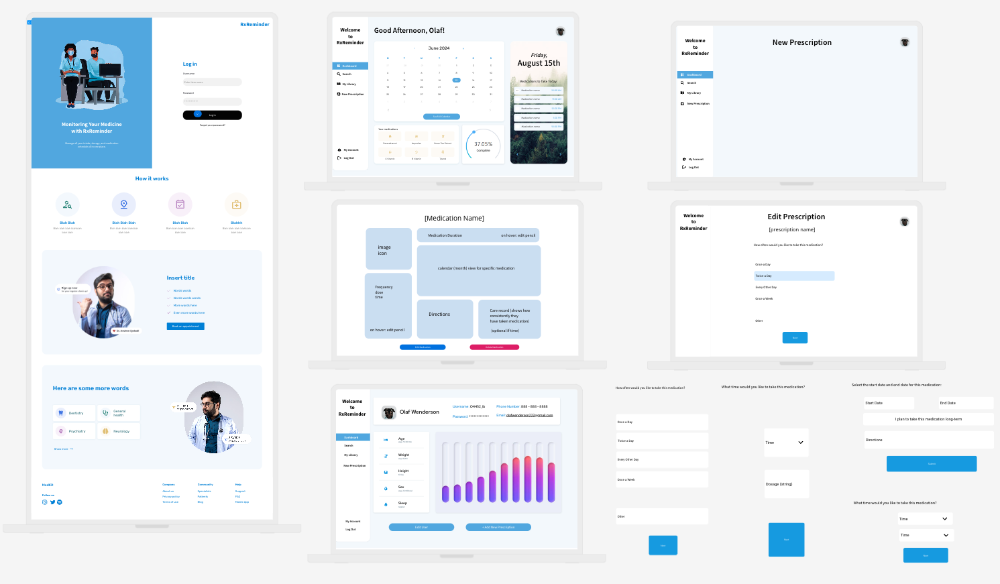

<p align="center">

</p>

# About
RxReMinder is a web application that helps users manage their medications. The application provides a variety of features, including:

- A prescription management system that allows users to track their prescriptions and set reminders for when they need to take their medication.
- A medication database that provides information about different medications and directions.
- A dose tracking system that allows users to track when they take their medication.
- A notification system that reminds users to take their medication and provides them with information about their medication.

RxReMinder is still under development, but it has the potential to be a valuable tool for people who take medication. The application is easy to use and provides a variety of features that can help users stay on top of their medication.

## **Built With**


## Deployment
- Frontend deployed on [Netlify]()
- Backend deployed on [Heroku]()
- Backend Github Repo [Github](https://github.com/Ellehcim23/RxReMinder-BE)

## Getting Started

1. Clone the repository:

```
git clone https://github.com/your-username/RxReMinder-BE.git
cd RxReMinder-BE
```
2. Install the dependencies:

```
npm install
```

3. Run the development server:

```zsh
npm run dev
```

Open [http://localhost:3000](http://localhost:3000) with your browser to see the result.

## Additional Installations:

C3 AI
```
npm install c3 d3
```
Chart JS
```
npm install chart.js
```

Faker
```
npm install --save-dev @faker-js/faker
```
Font Awesome
```
npm install @fortawesome/fontawesome-svg-core \
            @fortawesome/free-solid-svg-icons \
            @fortawesome/react-fontawesome
```
Moment
```
npm install moment
```

# **Preview Screen**
## Home




## Login


## Register


## Profile


# Key Features

- Authentication: RxReMinder uses JSON Web Tokens (JWT) for authentication to secure the API and ensure that only authorized users can access certain routes.
- CRUD operations: RxReMinder provides CRUD operations for users,prescriptions, medications, and doses. This allows users to create, read, update, and delete their prescription data.
- Medication database: RxReMinder has a medication database that provides information about different medications and directions. This information can help users make informed decisions about their medication.
- Dose tracking: RxReMinder allows users to track when they take their medication. 
- Notification system: RxReMinder can send notifications to users to remind them to take their medication and provide them with information about their medication. This can help users stay on top of their medication and avoid missed doses.

RxReMinder is a valuable tool for people who take medication. The application is easy to use and provides a variety of features that can help users stay on top of their medication. If you are looking for a way to manage your medication, RxReMinder is a great option.

# Wireframe and Entity Relationship Diagram



# Future Enhancements 
- QR Code for each prescription
- Health Insurance Information
- Medications Generic and Brand Name
- Medication Side Effects
- Medication Interactions
- Health Care Provider 

### Stretch Goals
If permitted by legal we would like to essentially partnered with pharmacists to get the prescription information to automatically be entered into our database with user permission. This will allow the user to have a more seamless experience with their refill automatically being added to their profile.

# Sources
- [C3 AI Applications](https://c3.ai/) - A leading enterprise AI software provider for accelerating digital transformation.
- [Chart JS](https://www.chartjs.org/) - A JavaScript library for creating beautiful charts.
- [Courier](https://www.courier.com/) - A notification platform that helps developers add notifications to their applications.
- [Faker](https://fakerjs.dev/guide/) - A library for generating fake data.
- [Font Awesome](https://fontawesome.com/v4/get-started/) - An iconic font and CSS toolkit.
- [uiZard](https://uizard.io/) - A platform that uses AI to transform your hand-drawn wireframes into code.

# License 
The source code for the site is licensed under the MIT license, which you can find in the MIT-LICENSE.txt file.

<h2 align="center">Authors</h2>

<div align="center">
  <a href="https://github.com/darkartaudio">
    
  </a>
   <a href="https://github.com/Ellehcim23">
    
  </a>
    <a href="https://github.com/kacyphan7">
    
  </a>
   <a href="https://github.com/sp1441">
    
  </a>
</div>