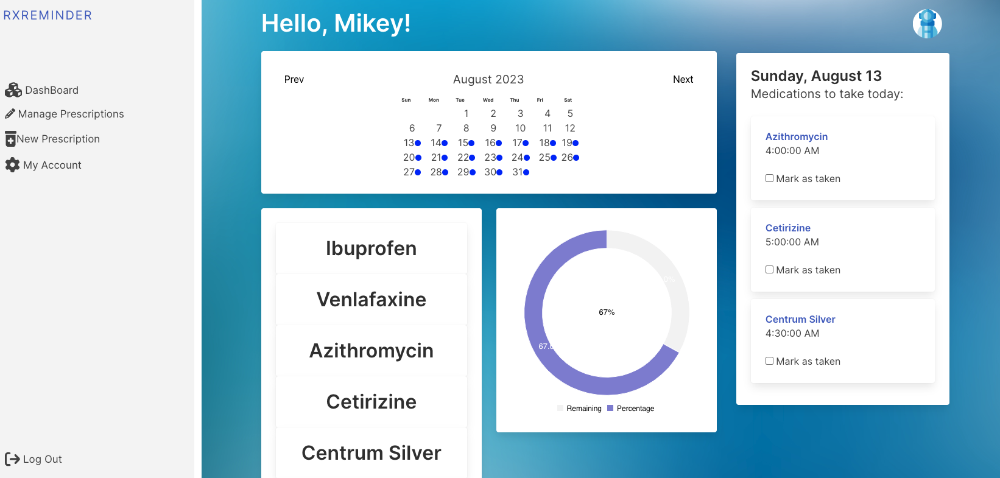
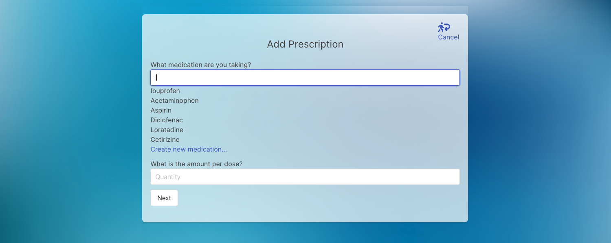

<p align="center">

</p>

# About
RxReMinder is a web application that helps users manage their medications. The application provides a variety of features, including:

- A prescription management system that allows users to track their prescriptions and set recurring reminders for medication doses.
- A user-driven medication database that provides classification and directions specific to medications.
- A dose tracking system that allows users to track upcoming, taken, and missed doses.
- A notification system that reminds users via email when it's time to take their medications.

RxReMinder is under development, but has the potential to be a valuable tool for anyone who takes medications. The application is easy to use and provides a variety of features that can help users stay on top of their medication.

## **Built With**


## Deployment
- Frontend deployed on [Netlify](https://rx-reminder.netlify.app/)
- Backend deployed on [Heroku](https://rxreminder-5f38ebd3ad7c.herokuapp.com/)
- Backend Github Repo [Github](https://github.com/Ellehcim23/RxReMinder-BE)

***

## Getting Started

### Prerequisites
* Node.js
* MongoDB database - local install or [Mongo Atlas](http://mongodb.com/atlas)
* A [Courier](https://app.courier.com/) API key

### Backend
1. `fork` and `clone` the [RxReMinder-BE](https://github.com/Ellehcim23/RxReMinder-BE) repository.
```zsh
git clone https://github.com/your-username/RxReMinder-BE.git
cd RxReMinder-BE
```
2. Install dependencies.
```zsh
npm install
```
3. Create a `.env` file in the repository root and add the follow environment variables:
```
MONGO_URI=insert-your-database-uri-here
JWT_SECRET=secret-key-of-your-choice
COURIER_KEY=your-courier-api-key-here
```
4. Start the backend server.
```zsh
npm run dev
```

### Database seeding (optional)
* Use the following command to pre-load your database with a provided collection of common medications.
```zsh
node seeders/medications.js
```

### Frontend
1. `fork` and `clone` this repository.
```zsh
git clone https://github.com/your-username/RxReMinder-FrontEnd
cd RxReMinder-FrontEnd
```
2. Install dependencies.
```zsh
npm install
```
3. Create a `.env` file in the repository root and add the following environment variable:
```
NEXT_PUBLIC_SERVER_URL=http://localhost:8000
```
4. Start the frontend server.
```zsh
npm run dev
```
5. Open [http://localhost:3000](http://localhost:3000) with your web browser to experience the app.

***

# **Screenshots**
## Home


## Login


## Register


## Dashboard


## Profile


## Add Prescription


## Manage Prescription


## View Single Prescription


## Medication


## Email Reminder 


***

# Code Snippets
## Bar Chart
```
 const daysOfWeek = ["Sunday", "Monday", "Tuesday", "Wednesday", "Thursday", "Friday", "Saturday"];
    const sunWeek = ["Monday", "Tuesday", "Wednesday", "Thursday", "Friday", "Saturday", "Sunday"];
    const monWeek = ["Tuesday", "Wednesday", "Thursday", "Friday", "Saturday", "Sunday", "Monday"];
    const tuesWeek = ["Wednesday", "Thursday", "Friday", "Saturday", "Sunday", "Monday", "Tuesday"];
    const wedWeek = ["Thursday", "Friday", "Saturday", "Sunday", "Monday", "Tuesday", "Wednesday"];
    const thurWeek = ["Friday", "Saturday", "Sunday", "Monday", "Tuesday", "Wednesday", "Thursday"];
    const friWeek = ["Saturday", "Sunday", "Monday", "Tuesday", "Wednesday", "Thursday", "Friday"];
    const satWeek = ["Sunday", "Monday", "Tuesday", "Wednesday", "Thursday", "Friday", "Saturday"];

    const today = new Date().getDay();
    let weekLabel;

    switch (daysOfWeek[today]) {
        case "Sunday": weekLabel = sunWeek; break;
        case "Monday": weekLabel = monWeek; break;
        case "Tuesday": weekLabel = tuesWeek; break;
        case "Wednesday": weekLabel = wedWeek; break;
        case "Thursday": weekLabel = thurWeek; break;
        case "Friday": weekLabel = friWeek; break;
        case "Saturday": weekLabel = satWeek; break;
    }
```
## Create a New Prescription
```
router.post('/new', passport.authenticate('jwt', { session: false }), async (req, res) => {
    try {
        const userId = req.user.id;
        const { medId, freq, time1, time2, quantity, startDate, endDate, notes, timezone } = req.body;

        let firstTime1, firstTime2;
        const dose1Times = [];
        const dose2Times = [];
        const numDays = DateTime.fromISO(endDate).diff(DateTime.fromISO(startDate), 'days').toObject().days;

        firstTime1 = DateTime.fromISO(`${startDate}T${time1}-0${timezone}:00`);
        if (freq === 'twice') firstTime2 = DateTime.fromISO(`${startDate}T${time2}-0${timezone}:00`);

        switch (freq) {
            case 'twice':
                for (let i = 0; i < numDays; i++) {
                    dose2Times.push(DateTime.fromISO(firstTime2).plus({ days: i }).toISO());
                }
            case 'once':
                for (let i = 0; i < numDays; i++) {
                    dose1Times.push(DateTime.fromISO(firstTime1).plus({ days: i }).toISO());
                }
                break;
            case 'alternate':
                for (let i = 0; i < numDays; i += 2) {
                    dose1Times.push(DateTime.fromISO(firstTime1).plus({ days: i }).toISO());
                }
                break;
            case 'weekly':
                for (let i = 0; i < numDays; i += 7) {
                    dose1Times.push(DateTime.fromISO(firstTime1).plus({ days: i }).toISO());
                }
                break;
        }

        let user = await User.findById(userId);
        let med = await Medication.findById(medId);

        const newPrescription = new Prescription({
            user: user,
            medication: med,
            quantity: quantity,
            notes: notes,
        });
        user.prescriptions.push(newPrescription);
        await user.save();


        for (let i = 0; i < dose1Times.length; i++) {
            const newDose = new Dose({
                user: user,
                prescription: newPrescription,
                medication: med,
                time: dose1Times[i],
            });
            await newDose.save();
            newPrescription.doses.push(newDose);

            if(freq === 'twice') {
                const newDose = new Dose({
                    user: user,
                    prescription: newPrescription,
                    medication: med,
                    time: dose2Times[i],
                });
                await newDose.save();
                newPrescription.doses.push(newDose);
            }
        }

        const savedPrescription = await newPrescription.save();
        const lookupPrescription = await Prescription.findById(savedPrescription._id);

        res.status(201).json({ message: 'Prescription created successfully.', prescription: lookupPrescription });
    } catch (error) {
        res.status(500).json({ message: 'Error creating prescription.', error });
    }
});
```

## Notification System
```
async function sendNotifications() {
    let doses = await Dose.find({ time: { $lt: new Date() }, taken: false, notified: false }).populate('user').populate('medication').sort({ time: 1 });
    
    console.log(doses.length);

    for (let i = 0; i < doses.length; i++) {
        let dose = doses[i];
        let email = dose.user.email;
        let name = dose.user.firstName;
        let medication = dose.medication.name;
        let userOffset = dose.user.timezone;
        let serverOffset = DateTime.local().offset / -60;
        let myOffset = serverOffset - userOffset;
        let time = DateTime.fromJSDate(dose.time).plus({ hours: myOffset }).toFormat('h:mm a');
        let date = DateTime.fromJSDate(dose.time).toFormat('ccc, LLL dd');

        console.log(email, name, medication, time, date, userOffset, serverOffset, myOffset);

        const { requestId } = await courier.send({
            message: {
                to: {
                    data: {
                        name: name,
                        medication: medication,
                        time: time,
                        date: date,
                    },
                    email: email,
                },
                content: {
                    title: "RxReminder Notification",
                    body: `Hi ${name}, it's ${time} on ${date}, time to take your ${medication}.\n\nhttps://rx-reminder.netlify.app`,
                },
                routing: {
                    method: "single",
                    channels: ["email"],
                },
            },
        });

        console.log(requestId);

        if(requestId) {
            console.log('Notification sent successfully');
            dose.notified = true;
            await dose.save();
        } else {
            console.log('Notification failed to send');
        }
    }
    process.exit(0);
}
```
***
# Wireframe and Entity Relationship Diagram


# Future Enhancements 
- QR Code for each prescription
- Health Insurance Information
- Medications Generic and Brand Name
- Medication Side Effects
- Medication Interactions
- Health Care Provider 

### Stretch Goals
If permitted by legal we would like to essentially partnered with pharmacists to get the prescription information to automatically be entered into our database with user permission. This will allow the user to have a more seamless experience with their refill automatically being added to their profile.

# Resources
- [Chart JS](https://www.chartjs.org/) - A JavaScript library for creating beautiful charts.
- [Courier](https://www.courier.com/) - A notification platform that helps developers add notifications to their applications.
- [Faker](https://fakerjs.dev/guide/) - A library for generating fake data.
- [Font Awesome](https://fontawesome.com/v4/get-started/) - An iconic font and CSS toolkit.
- [uiZard](https://uizard.io/) - A platform that uses AI to transform your hand-drawn wireframes into code.

# License 
The source code for the site is licensed under the MIT license, which you can find in the MIT-LICENSE.txt file.

<h2 align="center">Authors</h2>

<div align="center">
  <a href="https://github.com/darkartaudio">
    
  </a>
   <a href="https://github.com/Ellehcim23">
    
  </a>
    <a href="https://github.com/kacyphan7">
    
  </a>
   <a href="https://github.com/sp1441">
    
  </a>
</div>